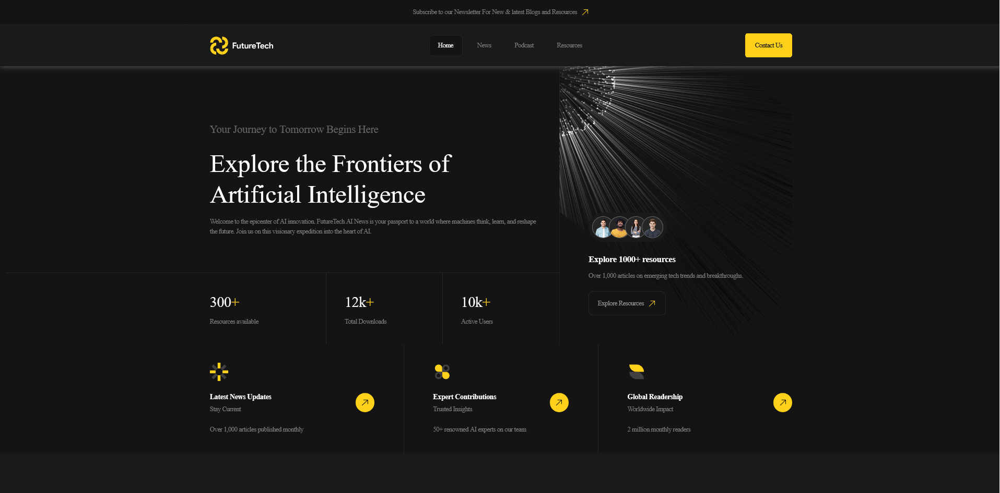
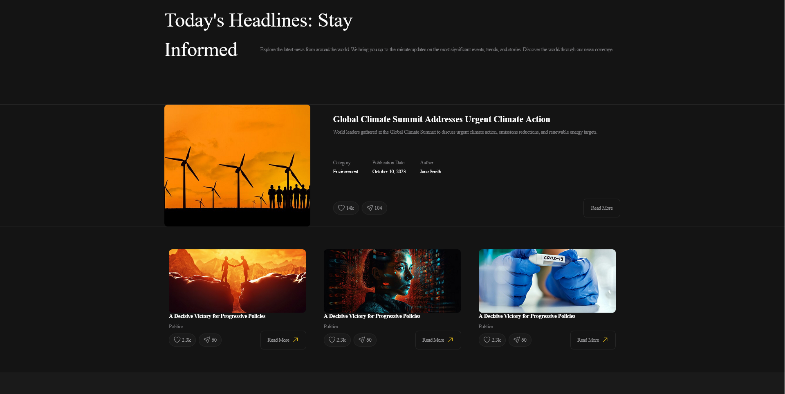
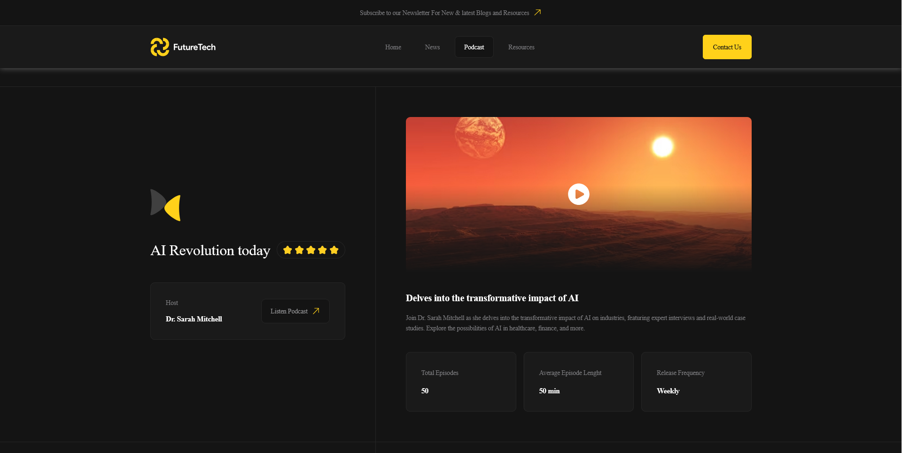
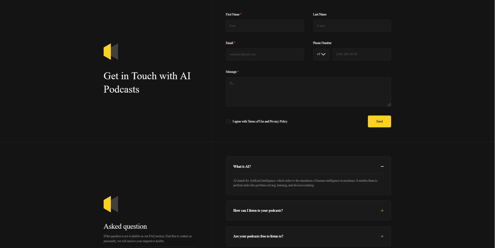

## 🤸 Demo

Git it a go [here](https://future-tech-one.vercel.app/) :)

   
    
   
  
  

     
    
    
  
  

   

 
 
News 
 
   
 
    
  
 
 
Podcasts
 
   
  
    
   
 
 
Contacts 
    
   
 
     

## 🚨 Info

This project was created to practice **semantic and accessible markup using BEM methodology**, **SASS styling**, and **modular JavaScript**, with each component having its own dedicated logic.
